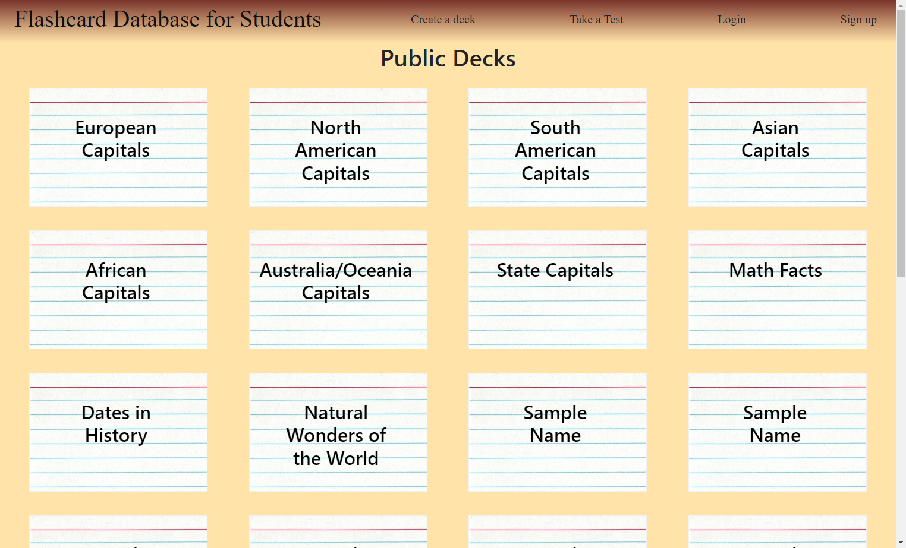

# Flash Card Database	
## Description
This website collects decks of flash cards to display to user. Users can sign up with an account or login on a pre-existing account to be able to create and edit flash cards of their own. Users can also view all decks that have been created and choose from a set of randomized tests to test their knowledge. The project focus on using a MySQL database alongside Sequelize to create and query. The site is intended to help user study for  topics they may be interested in.
## Table of Contents
- [Installation](#installation)
- [Usage](#usage)
- [Credits](#credits)
- [License](#license)
- [Questions](#questions)
## Installation
The repository can be found at: https://github.com/mhalder4/flash-card-database.
## Usage
Users will see all the availble decks upon opening the page. A deck can be clicked on to view the flash cards inside it. Users can also click the sign up or login buttons at the top to create an account or login to an existing account respectively. Once logged in, users can click the Create a Deck button to go to a deck editor page where questions and answers can be input. New cards can also be added, cards can be removed, and the deck name can be changed. Finally, there is a Take a Test button for the users to chose from a set of randomized tests to test their knowledge of all the cards in the database. Project can be rrun after using npm install and running the server.js file in the root of the project.

## Credits

## License
[MIT License](https://choosealicense.com/licenses/mit/)
MIT License

Copyright (c) 2023 Matthew Halder, Peter Krause, Joseph Lipovetz, Shahan Ameen, Griffin Thomas

Permission is hereby granted, free of charge, to any person obtaining a copy
of this software and associated documentation files (the "Software"), to deal
in the Software without restriction, including without limitation the rights
to use, copy, modify, merge, publish, distribute, sublicense, and/or sell
copies of the Software, and to permit persons to whom the Software is
furnished to do so, subject to the following conditions:

The above copyright notice and this permission notice shall be included in all
copies or substantial portions of the Software.

THE SOFTWARE IS PROVIDED "AS IS", WITHOUT WARRANTY OF ANY KIND, EXPRESS OR
IMPLIED, INCLUDING BUT NOT LIMITED TO THE WARRANTIES OF MERCHANTABILITY,
FITNESS FOR A PARTICULAR PURPOSE AND NONINFRINGEMENT. IN NO EVENT SHALL THE
AUTHORS OR COPYRIGHT HOLDERS BE LIABLE FOR ANY CLAIM, DAMAGES OR OTHER
LIABILITY, WHETHER IN AN ACTION OF CONTRACT, TORT OR OTHERWISE, ARISING FROM,
OUT OF OR IN CONNECTION WITH THE SOFTWARE OR THE USE OR OTHER DEALINGS IN THE
SOFTWARE.
## Questions
Find Matt on [GitHub](https://github.com/mhalder4)

Find Peter on [GitHub](https://github.com/Osorkon21)

Find Shahan on [GitHub](https://github.com/ShahanAmeen)

Find Joe on [GitHub](https://github.com/jlipovetz)

Find Griffin on [GitHub](https://github.com/HelloGriff)

  OR 
  [Email Us](mailto:placeholder@email.com)

